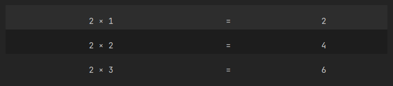
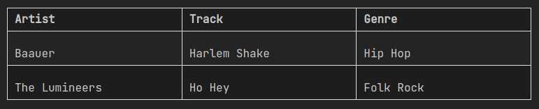
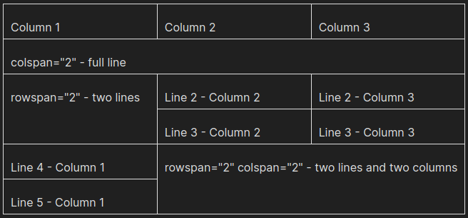

= Obsidian AsciiDoc Blocks Plugin
ifdef::env-github[]
:tip-caption: :bulb:
:note-caption: :information_source:
:important-caption: :heavy_exclamation_mark:
:caution-caption: :fire:
:warning-caption: :warning:
endif::[]

[.lead]
This is a plugin to render AsciiDoc blocks in Obsidian, initially *focused on tables*. 'Cause markdown tables are so limited!

== Examples

=== Headerless table (without grid and frames)


[cols="a,a"]
|===
| Markdown
| Result

|
[source]
----
```asciidoc-table
[frame="none",grid="none",cols="^3,^1,^2"]
\|===
\| 2 × 1 \| = \| 2
\| 2 × 2 \| = \| 4
\| 2 × 3 \| = \| 6
\|===
```
----

| 
|===

=== CSV Table

[cols="a,a"]
|===
| Markdown
| Result

|
[source]
----
```asciidoc-table
[%header,format=csv]
\|===
Artist,Track,Genre
Baauer,Harlem Shake,Hip Hop
The Lumineers,Ho Hey,Folk Rock
\|===

```
----

| 
|===

=== Span lines and columns

[cols="a,a"]
|===
| Markdown
| Result

|
[source]
----
```asciidoc-table
\|===
\| Column 1 \| Column 2 \| Column 3

3+\| colspan="2" - full line

.2+\| rowspan="2" - two lines
\| Line 2 - Column 2
\| Line 2 - Column 3
\| Line 3 - Column 2
\| Line 3 - Column 3

\| Line 4 - Column 1
2.2+\| rowspan="2" colspan="2" - two lines and two columns
\| Line 5 - Column 1
\|===
```
----

| 
|===

[TIP]
For more information about https://docs.asciidoctor.org/asciidoc/latest/tables/build-a-basic-table/[AsciiDoc Tables].

== IMPORTANT

At the moment any AsciiDoc feature might work, but there isn't any warranty and support! I hope in the future I could support other features officially!

[WARNING]
Maybe I'll restrain `asciidoc-table` for only support tables and create another unsupported block: `asciidoc-raw`.


== Thanks

* The first inspiration (and some code) came from https://github.com/valentine195/obsidian-admonition[Obsidian Admonition], thanks @valentine195;
* So many thanks, @francbreno for introducing me to Obsidian and spending some time discussing the idea of this plugin.
